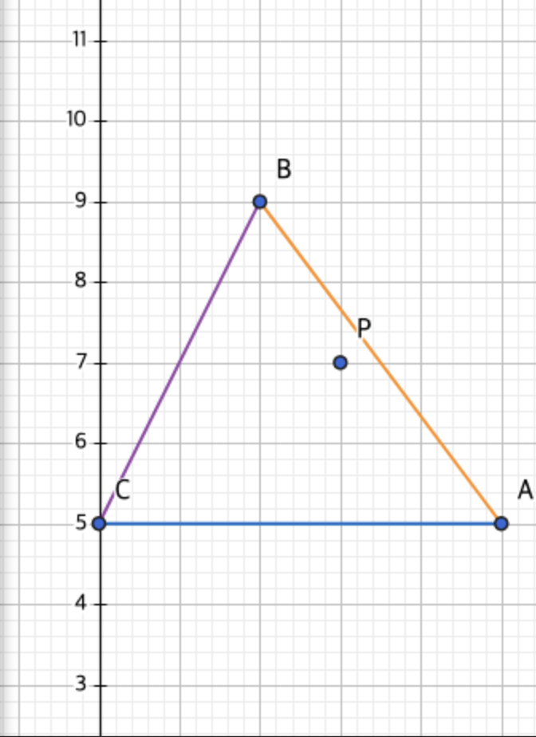

# BSP Triangle Point-Inclusion Project




This project aims to implement a function that checks if a point is inside a triangle using the `Fixed` class. BSP (Binary Space Partitioning) is a method used in 2D and 3D space partitioning, and here it is applied to solve the problem of determining whether a point lies inside a triangle. The triangle is defined by three points (vertices), and the goal is to check if a given point falls within the boundaries of this triangle.

I also includesd tests to validate different cases where a point is either inside or outside various triangles. Below are several test sets with triangle vertices and points inside or outside those triangles.

To run each test, copy and paste the command provided under each test set into your terminal:

### Example Set Explanation

For each set:
- **Triangle vertices**: Coordinates for the vertices of the triangle are provided as arguments to the `./fixed_bsp` executable.
- **Points inside**: These points are expected to be inside the triangle based on the vertex coordinates.
- **Points outside**: These points are expected to fall outside the triangle.

---
# Test Cases
 
## Set 1
### Triangle vertices:   
```bash 
./fixed_bsp 0 0 4 0 2 3`
```

### 🟩 Points inside 🟩:
- p 2 1
- p 1 1

### 🟧 Points outside 🟧:
- p -1 -1
- p 5 5
- p 4 4
- p 2 5
- p 6 1
- p 1 -2
- p -2 1

## Set 2
### Triangle vertices:
```bash
./fixed_bsp 1 1 5 1 3 4`
```

### 🟩 Points inside 🟩:
- p 3 2
- p 2 2
- p 4 2

### 🟧 Points outside 🟧:
- p 0 0
- p 6 2
- p 4 5
- p 7 3
- p 2 5
- p 0 3
- p 5 6

## Set 3
### Triangle vertices:
```bash
./fixed_bsp -3 -2 -1 4 2 0`
```

### 🟩 Points inside 🟩:
- p -1 1
- p 0 2
- p 1 1

### 🟧 Points outside 🟧:
- p 3 3
- p -5 -1
- p 1 5
- p 4 1
- p -2 -4
- p 0 -3
- p -4 5

## Set 4
### Triangle vertices:
```bash
./fixed_bsp 2 2 6 2 4 5`
```

### 🟩 Points inside 🟩:
- p 3 3
- p 4 3

### 🟧 Points outside 🟧:
- p 1 3
- p 7 1
- p 5 4
- p 5 6
- p 3 6
- p 8 2
- p 1 5
- p 2 7

## Set 5
### Triangle vertices:
```bash
./fixed_bsp -2 -1 3 -1 0 3`
```

### 🟩 Points inside 🟩:
- p 0 1
- p 1 0
- p -1 0

### 🟧 Points outside 🟧:
- p 4 0
- p -4 -3
- p 2 5
- p -5 1
- p 5 -2
- p -3 -2
- p 1 -4
<!---

--->

